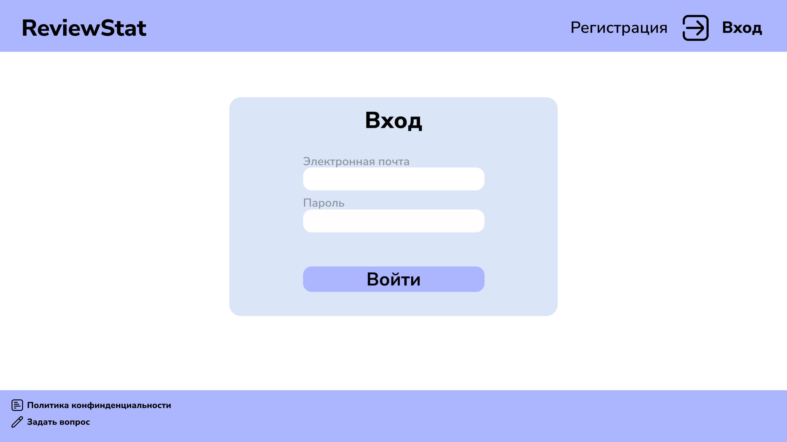
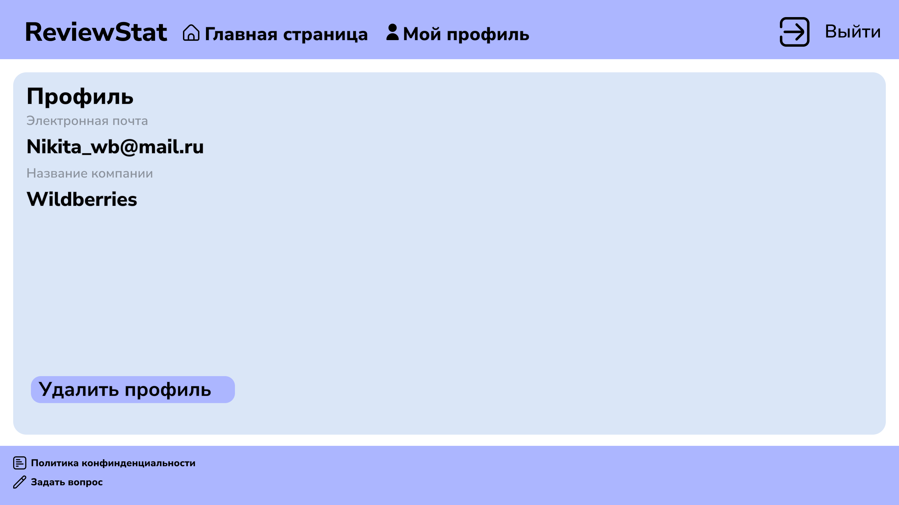
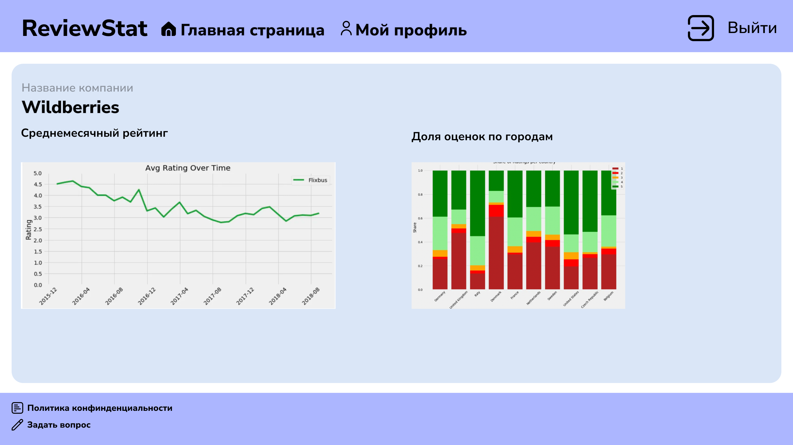

# ReviewStat
## Описание проекта
ReviewStat - веб-сайт, производящий количественный и качественный анализы на основе отзывов потребителей с сайта [otzovik.com](https://otzovik.com/)
 и предоставляющий результаты в виде графиков и диаграмм.
Количественный анализ производится на основе оценки рецензента и даты публикации отзыва, качественный производится на основе построения биграмм текста отзыва с помощью технологий обработки естественного языка.

## Стек 
* **Django 4.2.1**
* **PostgreSQL 13.4**
* **nltk 3.8.1**

## Скринкаст
Скринкаст работы сайта - **[ссылка](https://youtu.be/i6OyzndpXBI)**

## Дизайн сайта

